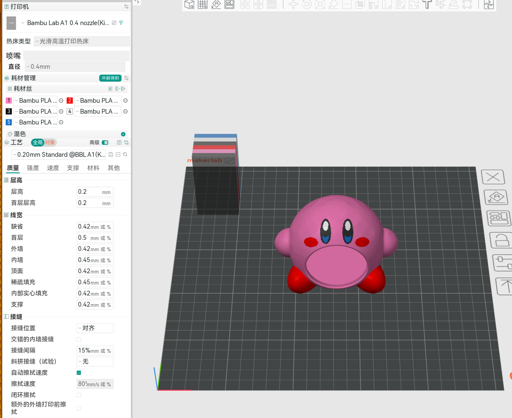
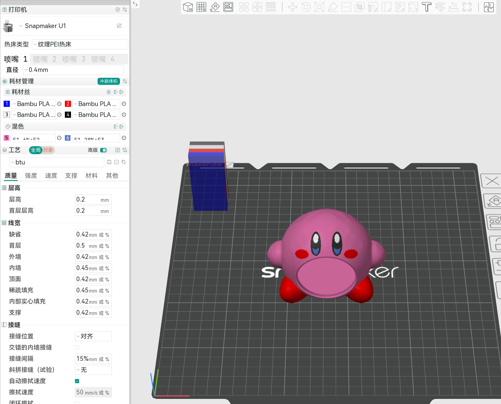

# btu

[English](README.md)

`btu` 将 Bambu Studio 3MF 中的材料分配转换为 Snapmaker U1 3MF，同时保留源模型几何结构。它既支持普通的按几何分层项目，也支持 Bambu 原生的全光谱混色材料。对于普通项目，无法使用物理耗材槽的颜色会自动转换为 U1 全光谱混色材料。

## 功能特性

- 保留源模型的几何结构、层高、表面涂色、材料配置和受支持的混色材料定义，同时将打印机专属元数据替换为 Snapmaker U1 设置。
- 内置适用于 0.2、0.4、0.6 和 0.8 mm 喷嘴的 U1 基准配置，并可通过可选的 U1 3MF 模板覆盖自定义打印机和工艺设置。
- 根据实际使用的涂色材料优化四个物理耗材槽，并在打印前报告所需的 T1-T4 顺序。
- 为使用 CMY 加中性色的多盘项目分别规划灰、白、黑耗材切换，并输出可尽量减少手动换料次数的推荐打印盘顺序。
- 生成支持比例、循环、匹配和渐变混合模式的 U1 全光谱虚拟材料，并允许在交互操作中为每种颜色单独选择模式。
- 拒绝自动混色时，保留全部源材料槽及其设置，不施加四槽逻辑材料限制。
- 在终端中提供交互式色彩方案检查、进度显示和覆盖确认，并在替换已有文件前验证临时 3MF。

## 转换效果对比

下例展示了同一个涂色模型转换前后的效果。源项目使用 Bambu Lab A1 配置和五种源材料。转换后的项目使用 Snapmaker U1，将直接可用的颜色映射到四个物理耗材槽，并为其余颜色添加两种全光谱虚拟材料。模型几何结构、涂色和源层高均被保留。

| 转换前：Bambu Lab A1 项目 | 转换后：由 `btu` 转换的 Snapmaker U1 项目 |
| --- | --- |
|  |  |

内置 U1 基准配置提供适用于 0.2、0.4、0.6 和 0.8 mm 喷嘴的打印机、工艺、喷嘴及 U1 相关挤出设置。源文件提供几何结构、层高、材料配置、材料引用、表面涂色及受支持的混色材料定义。可选的 U1 3MF 模板可以覆盖内置基准配置。

## 安装

```sh
go install github.com/nzlov/btu/cmd/btu@latest
```

该命令会将 `btu` 安装到 `GOBIN`；如果未设置 `GOBIN`，则安装到 `GOPATH/bin`。运行 `btu` 前，请确保相应目录已加入 `PATH`。

## 从源码构建

```sh
go build -o btu ./cmd/btu
```

## 转换

CLI 显示语言跟随 `LANG`。以 `zh` 开头的语言环境（例如 `zh_CN.UTF-8` 和
`zh-TW`）显示简体中文，其他值显示英文。

```sh
./btu \
    ~/Downloads/Fantasmino.3mf
```

未指定 `--output` 时，输出文件为 `~/Downloads/Fantasmino-btu.3mf`。如果该文件已存在，交互式终端会在替换前询问确认。非交互式替换或跳过确认时，请传入 `--replace`。

选项：

| 长选项 | 短选项 | 必需 | 用途 |
| --- | --- | --- | --- |
| `--output FILE` | `-o FILE` | 否 | 覆盖默认的 `SOURCE-btu.3mf` 输出路径 |
| `--replace` | `-r` | 否 | 不经询问直接替换已有输出文件 |
| `--colors ORDER` | `-c ORDER` | 否 | 使用 `c`、`m`、`y`、`g`、`w` 和 `b` 中四个不同的代码设置当前 T1-T4 色序 |
| `--full-spectrum` | `-f` | 否 | 使用已装载的耗材合成源颜色 |
| `--mix-mode MODE` | `-m MODE` | 否 | 将生成的混色材料模式设为 `ratio`、`cycle`、`match` 或 `gradient`（默认：`ratio`） |
| `--[no-]subdivide-layer-height` | | 否 | 无需打开 TUI 即可启用或禁用全部三个 Local-Z 细分设置 |
| `--nozzle DIAMETER_MM` | `-n DIAMETER_MM` | 否 | 强制使用内置基准配置；可选值为 `0.2`、`0.4`、`0.6` 或 `0.8`（毫米） |
| `--template FILE` | `-t FILE` | 否 | 覆盖内置 U1 基准配置 |

默认情况下，`btu` 从源 3MF 中读取 `nozzle_diameter` 并选择匹配的内置 U1 基准配置。如果 U1 将使用不同喷嘴，可覆盖该选择：

```sh
./btu \
    --nozzle 0.6 \
    ~/Downloads/model.3mf
```

所选基准配置提供 Snapmaker U1 的打印机、工艺、喷嘴、切片和喷嘴相关挤出元数据。材料类型、温度、流量比例、密度、冷却和热床温度等材料属性来自源文件，并按材料映射进入 U1 槽位。当属性不同的多个源材料共用一个 U1 物理组件时，该组件保留 U1 基准值，而不会随意选取某个源材料配置。只有需要用其他 U1 3MF 覆盖内置基准配置时才应传入 `--template`。同时使用 `--template` 和 `--nozzle` 时，会先加载模板，再在其上应用所选的内置喷嘴配置；模板中不相关的设置和元数据保持不变。

使用四个不同字符描述 T1 到 T4 槽位当前装载的颜色：

- `c`：青色/蓝色
- `m`：品红色/红色
- `y`：黄色
- `g`：灰色
- `w`：白色
- `b`：黑色

默认起始色序为 `cmyg`。例如，当 T1 到 T4 当前依次装载黑色、品红色、青色和黄色时，使用 `bmcy`：

```sh
./btu \
    --output ~/Downloads/model-for-u1.3mf \
    --colors bmcy \
    ~/Downloads/model.3mf
```

对于普通项目，`btu` 会分析表面涂色中材料的实际使用情况，并比较所有四种颜色的子集。它依次优先考虑最低的最大颜色误差、较低的加权总误差、较少的混色组件，以及相对当前槽位顺序更少的变更。转换后的 3MF 和“所需 U1 色序”输出使用选定的顺序。例如，一个包含红、粉、蓝、白、黑的模型可以将起始 `cmyg` 转换为 `cmwb`，用白色和黑色替换未使用的黄色和灰色。

对于所选色板仍包含 CMY 和一种中性色的普通多盘项目，`btu` 会读取每个盘的 `plater_id`、`plater_name`、对象归属和实际材料使用情况。它固定所选的 CMY 槽位，并为每个非空打印盘独立选择灰色、白色或黑色作为已配置中性色槽位的耗材。输出仍是一个使用全局材料映射的多盘 3MF。CLI 会对使用相同中性耗材的打印盘进行分组，并使用每个盘的序号和盘名输出推荐顺序。当前预览中性色分组优先输出，仅在组间更换该槽位的耗材，从而在不修改 3MF 中存储的打印盘顺序的前提下尽量减少耗材更换。其他四色子集使用转换器报告的同一固定色序。

Orca 无法将灰、白、黑表示为由同一个物理槽位支持的三个独立单组件虚拟材料。因此，动态中性色项目只保留一种全局预览中性色，实际打印则使用各盘步骤中指定的中性耗材。空盘名会保持为空；`btu` 不会用模型名称替代它。

转换器会将为打印盘选定的中性色直接映射到已配置的中性色槽位，并在需要时混合其他已映射颜色。它根据该盘分析出的色板，按照所需槽位顺序搜索配方；使用与 FullSpectrum 相同的 MIT 许可 FilamentMixer 模型对预览色评分；创建所需虚拟材料；重新映射模型及表面涂色引用；并启用 U1 Local-Z 混色打印。如果同一种源材料在选择不同中性色的多个盘上打印，其共享配方将只使用 CMY，从而保证同一个材料 ID 在整个项目中有效。已声明但未使用的颜色会保留确定性映射，但不会影响打印盘的中性色选择。由于物理耗材的不透明度和透光率各不相同，预览色仅为估算结果。

例如，一个四盘项目可能输出：

```text
所需 U1 色序：cmyg
打印步骤（推荐顺序，T4 更换 2 次）：
  保持 T4 为灰色（cmyg）：打印盘 4 - nose
  将 T4 从灰色更换为白色（cmyw）：打印盘 1 - eyes, 打印盘 3 - ears
  将 T4 从白色更换为黑色（cmyb）：打印盘 2 - body
```

```sh
./btu \
    --output ~/Downloads/model-full-spectrum.3mf \
    --full-spectrum \
    --subdivide-layer-height \
    --mix-mode match \
    ~/Downloads/model.3mf
```

生成的混色材料支持 Snapmaker Orca 的四种模式：

- `ratio` 使用最接近的加权配方，最多包含三种耗材。
- `cycle` 将最多包含四种耗材的加权配方转换为均衡、循环的分层图案。
- `match` 使用最接近的加权配方，最多包含四种耗材。
- `gradient` 选择最接近的 50:50 双耗材组合，并创建从 80% A 到 20% A 的 A 到 B 渐变。

所有未使用 `--full-spectrum` 启动的转换都会打开色彩方案检查，包括所有颜色都能直接映射到 T1-T4 的项目。左侧显示完整的源色序，右侧显示规划后的 U1 色序。右侧行标记为“基色”“材料”或“混合色”；只有混合色行提供混合模式。使用上/下键选择可编辑输出，使用左/右键替换，按 Enter 应用。在混合色行中，Tab 键用于在模式和替换选项之间切换焦点。所选输出可以替换为任意物理基础槽位或其他已有输出。映射到该输出的所有源颜色会一起改变；不再需要的混色槽或普通材料槽会被删除，其余槽位会重新编号。

当已声明的源颜色需要合成时，终端会先询问是否使用全光谱混色生成。选择“是”会检查去重后的混色输出及其预览色。选择“否”会依次检查所需的 T1-T4 基础色序，以及源 T1...Tn 顺序中每种源材料对应的一个普通材料槽。这些普通槽会保留各自的材料设置，且不受四种逻辑材料限制。在任一色序下方，同一个 TUI 都会提供层高细分、填充细分和整个对象细分三个独立控件。使用上/下键选择，使用左/右键或空格键更改。

直接传入 `--full-spectrum` 且未指定任一层高标志时，TUI 会打开仅设置视图，其中包含相同的三个独立控件。`--subdivide-layer-height` 会同时启用全部三个控件，`--no-subdivide-layer-height` 会同时禁用它们，因此非交互运行仍可使用一个显式标志。

全光谱输出还会将擦料塔清料体积（`prime_volume`）设为 `20` mm^3。如果转换更改了所选 U1 基准配置中的任何受支持工艺设置，`btu` 会嵌入名为 `btu` 的项目工艺预设。该预设继承所选的 U1 系统预设，并只保存发生变化的值，例如混色材料定义、Local-Z 选项、清料体积或源层高。如果没有任何受支持的工艺设置发生变化，输出将保留所选系统预设，不会创建冗余项目预设。

不带 `--full-spectrum` 的非交互运行会返回错误，因为色彩方案必须经过检查。无人值守转换时，请传入 `--full-spectrum`、显式的 `--subdivide-layer-height` 或 `--no-subdivide-layer-height`，以及所需的 `--mix-mode`；该模式会应用于所有生成的混色材料。

需要时可覆盖内置基准配置：

```sh
./btu \
    --output ~/Downloads/model-for-u1.3mf \
    --template ~/Downloads/custom-u1.3mf \
    ~/Downloads/model.3mf
```

交互式终端使用 Bubble Tea 显示进度；输出被重定向或无 TTY 时，则输出纯文本阶段信息。分析、归档重写和验证会报告准确的已完成及总任务项数量，其中包括每个模型或归档成员。

只有临时 3MF 通过验证后，替换结果才会发布。拒绝确认会保持已有输出不变。Bambu 的穿透层设置在 U1 中没有直接对应项，因此不会被转移。非线性或按部件定义的渐变曲线会被拒绝，而不会近似处理。已包含原生混色材料的项目会使用其现有定义，不能同时传入 `--full-spectrum`。
